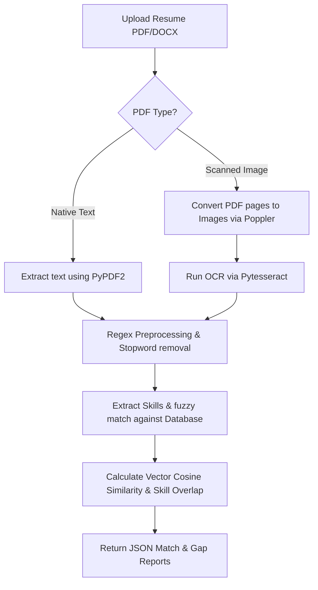

# 🚀 FitPredict-AI: Enterprise AI Resume Analyzer & Capstone Analytics Dashboard

An advanced, production-grade, and professional multi-view document intelligence and talent acquisition system. Designed as a final-year university capstone project, **FitPredict-AI** automates resume ingestion, structural text extraction, fuzzy keyword indexing, and semantic job-fit analysis.

The system features a custom state-based multi-page dashboard, real-time auto-balancing weight configurations, bulk processing pipelines, history logs database, and print-optimized PDF reporting.

---

## 🌟 Key Features

* **Multi-Page Capstone Navigation Architecture:** Transitions the application from a single form into a comprehensive dashboard containing:
  - **View 1: Home / Ingestion:** Upload resumes and paste target requirements.
  - **View 2: Report Analytics:** In-depth match visualization, technical subscore metrics (Tech, Education, Traits), matching keywords tags, requirements gaps, and recruitment action plans.
  - **View 3: Scan Database Logs:** Review and load detailed reports of all past candidate matching operations.
  - **View 4: Advanced Bulk Leaderboard:** Parallel candidate ingestion comparison that ranks bulk files instantly.
  - **View 5: Sliders Config:** Customize mathematical matching weights and NLP models.
* **Auto-Balancing Slider Weight Engine:** Modifying any slider (Technical skills, Education degrees, or Traits) automatically balances the remaining parameters proportionally to maintain a sum of exactly **100%**.
* **Model Selection Pipeline:** Toggle between **TF-IDF Term Overlap Vectorization** (fast keyword mapping) and **BERT Semantic Transformer** (synonym matching and contextual trait analysis).
* **Hybrid Ingestion OCR Fallback:** Extracts content from native PDF and DOCX files. If a scanned document is detected, the system triggers a fallback OCR pipeline using **Pytesseract** and **pdf2image** (Poppler).
* **Fuzzy Skill Matcher:** Configured with a Levenshtein-distance fuzzy parser (at an 85% matching threshold) via `thefuzz` to prevent keyword mismatches due to spacing, casing, or typo variances.
* **Print-Optimized PDF Export:** Generates clean, printer-friendly A4 analysis reports by applying dedicated print media stylesheets to hide interface noise.
* **Self-Healing Dependencies:** Backend includes a startup wrapper that auto-detects and installs any missing runtime modules using the current Python environment context.

---

## 🛠️ Tech Stack

| Component | Technologies Used |
| :--- | :--- |
| **Frontend** | React.js, Custom CSS Design System, Axios, Glassmorphic Overlay |
| **Backend** | Flask (Python REST API), PyPDF2, docx2txt |
| **OCR Pipeline** | Tesseract-OCR, pdf2image (Poppler) |
| **Fuzzy Matching** | thefuzz, python-Levenshtein |
| **AI / NLP Core** | NLTK (Tokenization, Stopwords Filtering, WordNet Lemmatization) |
| **Machine Learning** | Scikit-learn (TF-IDF Vectorizer, Cosine Similarity) |

---

## 📊 Core Matching & Ingestion Pipeline



---

## ⚙️ Getting Started & Local Setup

Follow these steps to configure and run the full-stack system locally.

### 1. Clone the Repository
```bash
git clone https://github.com/junaidahmeddev/FitPredict-AI.git
cd FitPredict-AI
```

### 2. Backend Configuration (Flask)
```bash
# Navigate to the backend folder
cd backend

# Create and activate a Python virtual environment
python -m venv .venv
# On Windows PowerShell:
.\.venv\Scripts\Activate.ps1
# On Mac/Linux:
source .venv/bin/activate

# Install requirements & start server
pip install -r requirements.txt
python app.py
```
The server will run on `http://127.0.0.1:5000`. On launch, the self-healing block will verify and auto-install any missing dependencies.

### 3. External Dependencies (For OCR Fallback)
To enable scanned PDF support:
1. **Tesseract OCR:** Download the binary from [Tesseract OCR Windows Builds](https://github.com/UB-Mannheim/tesseract/wiki) and install to `C:\Program Files\Tesseract-OCR\`.
2. **Poppler:** Extract Poppler to `C:\poppler-26.02.0\Library\bin` or configure it in your System Path.

### 4. Frontend Configuration (React)
```bash
# Navigate to the frontend folder
cd ../frontend

# Install Node modules & start development server
npm install
npm start
```
The dashboard interface will automatically open on `http://localhost:3000`.

---

## 📈 Evaluation Matrix
* **Profile A (High Match):** Upload a technical engineering resume with Python, Flask, or React against a matching Software Engineer description. The system will report high scores with verified keyword matrices.
* **Profile B (Low Match/Cross-Field):** Upload the same engineering resume against a Graphic Designer job description. The system will highlight gaps in core design skills (e.g., Figma, Photoshop, typography).

---
⭐ Developed with 💻 by [Junaid Ahmed](https://github.com/junaidahmeddev)
