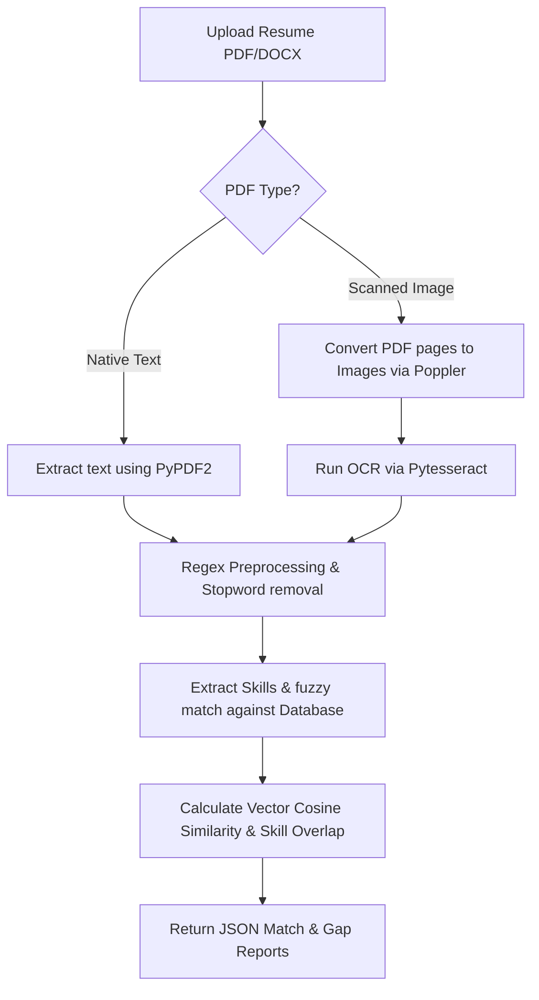

# 🚀 FitPredict-AI: Next-Gen AI Resume Analyzer & Job-Fit Predictor

An advanced, enterprise-grade NLP-powered recruitment tool that automates resume screening, text extraction, and semantic job fit analysis. Utilizing modern vector space models combined with fallback OCR mechanisms and fuzzy matching algorithms, the system evaluates resume alignment against target job descriptions with extreme precision.

---

## 🌟 Key Features

* **Hybrid Text Extraction (Native & Scanned PDFs):** Seamlessly extracts raw content from PDF and DOCX formats. If a PDF yields no direct text (e.g., scanned images), the system automatically triggers a fallback OCR pipeline via **Pytesseract** and **pdf2image** (Poppler).
* **Fuzzy Skill Matcher:** Replaces legacy strict matching with Levenshtein-distance fuzzy matching using the `thefuzz` library (configured at a robust 85% threshold) to capture typos, case variations, and n-gram skills.
* **Weighted Scoring Engine:** Computes compatibility using a weighted matrix (30% Cosine Similarity via TF-IDF Vectorization, 70% Core Skill Intersection Overlap).
* **Zero-Norm Safety Checks:** Gracefully handles empty vectors or non-standard profiles to prevent calculation errors, falling back entirely to skill matching.
* **Self-Healing Dependencies:** Backend includes a startup wrapper that auto-detects and installs any missing runtime modules using the current Python environment context.
* **Premium Glassmorphic UI:** Modern dark-themed dashboard built with React, styled with Tailwind CSS, and equipped with real-time feedback indicator elements.

---

## 🛠️ Tech Stack

| Component | Technologies Used |
| :--- | :--- |
| **Frontend** | React.js, Tailwind CSS, Axios, Glassmorphic CSS System |
| **Backend** | Flask (Python REST API), PyPDF2, docx2txt |
| **OCR Pipeline** | Tesseract-OCR, pdf2image (Poppler) |
| **Fuzzy Matching** | thefuzz, python-Levenshtein |
| **AI / NLP Core** | NLTK (Tokenization, Stopwords Filtering, WordNet Lemmatization) |
| **Machine Learning** | Scikit-learn (TF-IDF Vectorizer, Cosine Similarity) |

---

## 📊 Core Matching & Extraction Pipeline



---

## ⚙️ Getting Started & Local Setup

Follow these steps to configure and run the full-stack system locally.

### 1. Clone the Repository
```bash
git clone https://github.com/junaidahmeddev/FitPredict-AI.git
cd FitPredict-AI
```

### 2. Backend Configuration (Flask)
```bash
# Navigate to the backend folder
cd backend

# Create and activate a Python virtual environment
python -m venv .venv
# On Windows PowerShell:
.\.venv\Scripts\Activate.ps1
# On Mac/Linux:
source .venv/bin/activate

# Install requirements & start server
pip install -r requirements.txt
python app.py
```
The server will run on `http://127.0.0.1:5000`. On launch, the self-healing block will verify and auto-install any missing dependencies.

### 3. External Dependencies (For OCR Fallback)
To enable scanned PDF support:
1. **Tesseract OCR:** Download the binary from [Tesseract OCR Windows Builds](https://github.com/UB-Mannheim/tesseract/wiki) and install to `C:\Program Files\Tesseract-OCR\`.
2. **Poppler:** Extract Poppler to `C:\poppler-26.02.0\Library\bin` or configure it in your System Path.

### 4. Frontend Configuration (React)
```bash
# Navigate to the frontend folder
cd ../frontend

# Install Node modules & start development server
npm install
npm start
```
The dashboard interface will automatically open on `http://localhost:3000`.

---

## 📈 Evaluation Matrix
* **Profile A (High Match):** Upload a technical engineering resume with Python, Flask, or React against a matching Software Engineer description. The system will report high scores with verified keyword matrices.
* **Profile B (Low Match/Cross-Field):** Upload the same engineering resume against a Graphic Designer job description. The system will highlight gaps in core design skills (e.g., Figma, Photoshop, typography).

---
⭐ Developed with 💻 by [Junaid Ahmed](https://github.com/junaidahmeddev)
